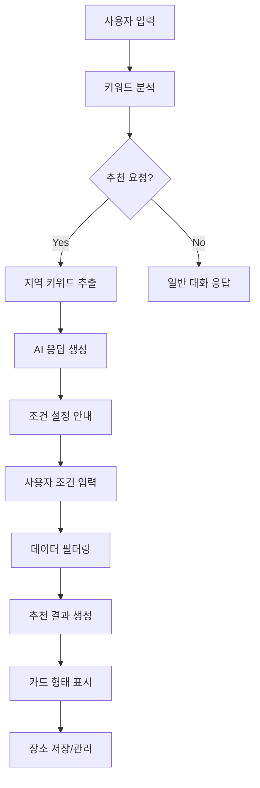

# CARE - Customized AI Recommendation Engine

##  프로젝트 개요

### 1. 목표 및 만든 이유

**CARE (Customized AI Recommendation Engine)**는 사용자의 상황과 취향에 맞춘 맞춤형 장소 추천 서비스입니다.

#### 개발 동기
- 기존 지도 앱이나 맛집 추천 사이트의 한계점 해결
- 인원수, 예산, 분위기 등 세부 조건을 고려한 정확한 추천 부족
- 개발자가 직접 경험한 좋은 장소들을 체계적으로 저장하고 있는 플랫폼 필요
- 사용자의 감정과 상황을 이해하여 최적의 선택을 제안하는 AI 기반 서비스 구현

#### 핵심 목표
- **맞춤형 추천**: 사용자의 상황(인원수, 예산, 분위기, 시간대, 목적)에 맞는 장소 추천
- **직관적 사용**: 복잡한 설정 없이 자연스러운 대화를 통한 추천 요청
- **개인화된 경험**: 사용자별 선호도 학습 및 맞춤형 추천 제공
- **장소 관리**: 좋아하는 장소 저장, 바구니 기능, 장소 리스트 생성 가능

---

## AI 기술 활용

### 2. OpenAI API 키 활용

#### API 설정
```javascript
const CARE_CONFIG = {
    OPENAI_ENDPOINT: 'https://api.openai.com/v1/chat/completions'
};
```

#### GPT 모델 사용
- **모델**: GPT-4o
- **용도**: 사용자 메시지 분석 및 자연스러운 대화 응답
- **토큰 제한**: 150 tokens (응답 효율성 고려)
- **온도 설정**: 0.7 (창의성과 일관성의 균형)

### 3. GPT 시스템 프롬프트 튜닝

#### 3.1 핵심 시스템 프롬프트
```javascript
{
    role: 'system',
    content: '당신은 친근한 AI 어시스턴트입니다. 사용자가 장소 추천을 요청하면 다음과 같이 응답해주세요:\n\n1. 장소 추천 요청이 들어오면 "아래 검색 조건 설정을 이용해서 원하는 장소를 찾아보세요! 카페 또는 맛집을 선택하고 예산, 인원수, 분위기, 시간대, 목적을 설정한 후 \'조건 적용\' 버튼을 눌러주세요."라고 안내해주세요.\n\n2. 일반적인 대화나 질문에는 친근하게 답변해주세요.\n\n3. 추천 장소는 텍스트로 제공하지 말고 반드시 검색 조건 설정을 사용하도록 안내해주세요.'
}
```

#### 3.2 키워드 추출을 위한 프롬프트 설계

**사용자 입력 분석을 위한 프롬프트 튜닝:**
```javascript
// 실제 코드에서 사용되는 키워드 감지 로직
// 제시한 키워드는 일부만 보여줍니다.
const recommendationKeywords = [
    // 장소 관련 키워드
    '추천', '장소', '카페', '맛집', '식당', '레스토랑', '음식점',
    
    // 상황/의도 키워드
    '어디', '갈까', '가고싶', '보고싶', '데이트', '점심', '저녁',
    '양식', '한식', '중식', '일식', '고기', '스테이크', '파스타',
    
    // 관계/상황 키워드
    '여자친구', '남자친구', '커플', '데이트', '만남', '친구',
    
    // 지역 키워드
    '강남', '강북', '서초', '마포', '홍대', '성북', '월곡', '강동', '천호',
    '역', '구', '동', '지역',
    
    // 활동 키워드
    '밥', '먹', '식사', '대학교'
];
```

#### 3.3 조건별 필터링을 위한 프롬프트 최적화

**1. 지역 자동 감지 프롬프트:**
```javascript
// 지역 키워드 매핑 시스템
// 제시한 키워드는 일부만 보여줍니다.

const LOCATION_MAPPING = {
    '강남': '강남구', '강남역': '강남구', '홍대': '마포구',
    '이태원': '이태원', '신촌': '신촌', '명동': '명동',
    '건대': '건대', '성수': '성수', '월곡': '월곡'
    // ... 70개 이상의 지역 매핑
};
```

**2. 카테고리 자동 분류 프롬프트:**
```javascript
// 카페 vs 맛집 구분을 위한 키워드 시스템
const cafeKeywords = [
    '카페', '다방', '티룸', '커피', '음료', '브런치', '디저트', 
    '베이커리', '루프탑', '테마', '스터디', '프리미엄', '24시간'
];

const foodKeywords = [
    '맛집', '식당', '레스토랑', '음식점', '한식', '양식', '중식', '일식'
];
```

**3. 예산 및 인원수 파싱 프롬프트:**
```javascript
// 예산 문자열을 숫자로 변환하는 로직
parseBudget(budget) {
    const match = budget.match(/(\d+)(만원|천원|원)/);
    if (match) {
        const num = parseInt(match[1]);
        const unit = match[2];
        if (unit === '만원') return num * 10000;
        if (unit === '천원') return num * 1000;
        if (unit === '원') return num;ㅇ
    }
    return 0;
}
```

#### 3.4 프롬프트 설계 

**1. 사용자 안내 중심 설계:**
- 직접적인 장소 추천보다는 시스템 사용법 안내
- 사용자가 웹 인터페이스를 활용하도록 유도
- 일관된 사용자 경험 제공

**2. 키워드 기반 자동화:**
- 자연어 처리 없이도 키워드 매칭으로 빠른 응답
- 지역, 카테고리, 상황별 키워드 사전 구축
- 사용자 입력의 패턴 학습 및 개선

**3. 조건별 필터링 최적화:**
- 다단계 필터링 시스템 (지역 → 카테고리 → 예산 → 인원수)
- 사용자 설정이 없을 때 기본값 적용
- 필터링 결과가 없을 때 폴백 메커니즘

**4. 시스템 통합 최적화:**
- AI 응답과 웹 인터페이스의 원활한 연동
- 사용자 입력을 웹 폼 조건으로 자동 변환
- 실시간 조건 업데이트 및 반영

---

## 주요 코드 로직

### 4. 핵심 아키텍처

#### 4.1 인증 시스템 (auth.js)
```javascript
class AuthManager {
    // 사용자 인증 및 관리
    - login(username, password): 로그인 처리
    - register(username, password, email): 회원가입
    - logout(): 로그아웃
    - updateUser(updates): 사용자 정보 업데이트
    - changePassword(): 비밀번호 변경
    - deleteAccount(): 계정 삭제
}
```

**주요 특징:**
- LocalStorage 기반 사용자 데이터 관리
- 24시간 자동 로그인 만료 기능
- 실시간 사용자 상태 추적

#### 4.2 채팅 시스템 (chat.js)
```javascript
class CAREChat {
    // 핵심 3가지 주요 기능
    - isRecommendationRequest(): 텍스트 키워드 추출 및 추천 요청 감지
    - generateRecommendations(): 조건 필터링 기반 추천 장소 생성
    - displayRecommendations(): 추천 장소 카드 형태로 표시
    
    // AI 대화 및 데이터 관리
    - sendMessage(): 사용자 메시지 처리
    - getAIResponse(): OpenAI API 호출
    - loadPlaceData(): 장소 데이터 로드
    - extractRegion(): 지역 키워드 추출
}
```

**핵심 3가지 주요 로직:**
1. **텍스트 키워드 추출**: 사용자 입력에서 추천 의도 및 조건 감지
2. **조건 필터링**: 지역, 카테고리, 예산 등 조건별 장소 필터링
3. **추천 장소 표시**: 필터링된 결과를 카드 형태로 직관적 표시

#### 4.2.1 키워드 추출 및 조건 필터링 로직

**1. 추천 키워드 감지 시스템**
```javascript
const recommendationKeywords = [
    '추천', '장소', '카페', '맛집', '식당', '레스토랑', '음식점',
    '어디', '갈까', '가고싶', '보고싶', '데이트', '점심', '저녁',
    '양식', '한식', '중식', '일식', '고기', '스테이크', '파스타',
    '여자친구', '남자친구', '커플', '데이트', '만남',
    '강남', '강북', '서초', '마포', '홍대', '성북', '월곡', '강동', '천호',
    '역', '구', '동', '지역', '밥', '먹', '식사', '대학교', '친구'
];

// 사용자 메시지에서 키워드 확인
const userHasKeyword = recommendationKeywords.some(keyword => 
    userMessage.toLowerCase().includes(keyword)
);
```

**2. 지역 키워드 추출**
```javascript
extractRegion(message) {
    const regions = {
        '강남역': '강남구', '강남': '강남구', '홍대': '마포구',
        '이태원': '이태원', '신촌': '신촌', '명동': '명동',
        '건대': '건대', '성수': '성수', '월곡': '월곡'
        // ... 기타 지역 매핑
    };
    
    const lowerMessage = message.toLowerCase();
    for (const [keyword, region] of Object.entries(regions)) {
        if (lowerMessage.includes(keyword.toLowerCase())) {
            return region;
        }
    }
    return '강남구'; // 기본값
}
```

**3. 조건별 장소 필터링**
```javascript
let filteredPlaces = this.allPlaces.filter(place => {
    // 지역 필터
    if (this.currentRegionKeyword && this.currentRegionKeyword !== '') {
        const regionMatch = place.region.includes(normalizedKeyword) || 
                          place.address.includes(normalizedKeyword) ||
                          place.name.includes(normalizedKeyword);
        if (!regionMatch) return false;
    }
    
    // 카테고리 필터 (맛집/카페 구분)
    if (this.currentSearchConditions.category) {
        const cafeKeywords = ['카페', '다방', '티룸', '커피', '음료'];
        const isCafe = cafeKeywords.some(keyword => 
            place.category && place.category.includes(keyword)
        );
        
        if (this.currentSearchConditions.category === '카페' && !isCafe) {
            return false;
        } else if (this.currentSearchConditions.category === '맛집' && isCafe) {
            return false;
        }
    }
    
    return true;
});
```

**4. 예산 및 인원수 기반 필터링**
```javascript
filterRecommendationsBySettings(recommendations, budget, people) {
    let filtered = recommendations;
    
    // 예산 필터링
    if (budget) {
        const budgetNum = this.parseBudget(budget);
        if (budgetNum > 0) {
            filtered = recommendations.filter(place => {
                const placePrice = this.parsePriceRange(place.price_range);
                return placePrice <= budgetNum;
            });
        }
    }
    
    // 인원수 필터링 (단체석 우선)
    if (people > 4) {
        filtered = filtered.filter(place => 
            place.features.includes('단체석') || 
            place.features.includes('그룹모임')
        );
    }
    
    return filtered.length > 0 ? filtered : recommendations;
}
```

#### 4.3 설정 관리 (config.js)
```javascript
// 카테고리 매핑
const CATEGORY_CODES = {
    '맛집': 'FD6',
    '카페': 'CE7',
    '문화시설': 'CT1',
    // ... 기타 카테고리
};

// 지역 매핑
const LOCATION_MAPPING = {
    '강남': '강남구',
    '홍대': '마포구',
    // ... 기타 지역
};
```

#### 4.4 장소 데이터 관리
- **정적 데이터**: 하드코딩된 기본 장소 정보
- **동적 로딩**: location_cafe, location_food 폴더의 분할된 데이터 파일
- **실시간 필터링**: 사용자 조건에 따른 동적 필터링

### 4.5 주요 기능 플로우

#### 4.5.1 사용자 텍스트 기반 추천 플로우

**1단계: 사용자 입력 분석**
**예시 지역 : 강남**
```javascript
// 사용자 메시지에서 키워드 추출
// 강남으로 예시를 들어보겠습니다.
const userMessage = "강남에서 데이트할 카페 추천해줘";
const hasRecommendation = isRecommendationRequest(userMessage);
const extractedRegion = extractRegion(userMessage); 
```

**2단계: AI 응답 및 조건 설정**
```javascript
// GPT를 통한 자연스러운 응답
const aiResponse = await getAIResponse(userMessage);
// "아래 검색 조건 설정을 이용해서 원하는 장소를 찾아보세요!"

// 자동으로 지역 설정
window.setRegionFromChat(userMessage); 
```

**3단계: 조건별 데이터 필터링**
```javascript
// 1차: 지역 필터링
let filteredPlaces = allPlaces.filter(place => 
    place.region.includes('강남 장소')
);

// 2차: 카테고리 필터링 (카페만)
filteredPlaces = filteredPlaces.filter(place => 
    place.category.includes('카페')
);

// 3차: 예산 필터링 (사용자 설정 기반)
if (budget) {
    filteredPlaces = filterByBudget(filteredPlaces, budget);
}

// 4차: 인원수 필터링
if (people > 4) {
    filteredPlaces = filterByGroupSize(filteredPlaces, people);
}
```

**4단계: 추천 결과 표시**
```javascript
// 카드 형태로 추천 장소 표시
displayRecommendations(filteredPlaces);
// - 장소명, 주소, 전화번호, 평점, 가격대
// - 특징 태그 (WiFi, 주차장, 단체석 등)
// - 바구니 저장 버튼
```

#### 4.5.2 전체 추천 시스템 아키텍처



#### 4.5.3 부가 기능 (장바구니 및 공유)

**장소 저장 및 관리**
```javascript
// 사용자가 관심 있는 장소를 바구니에 저장
addToCart(place) {
    basketPlaces.push({
        ...place,
        addedAt: new Date().toISOString(),
        place_name: place.name,
        road_address_name: place.address
    });
    localStorage.setItem('care_basket_places', JSON.stringify(basketPlaces));
}

// 저장된 장소 목록 표시 및 관리
renderBasket() {
    basketPlaces.forEach(place => {
        // 장소 카드 생성, 제거 버튼, 지도 보기 버튼 추가
    });
}
```

**추천 코스 생성 및 공유**
```javascript
// 저장된 장소들로 추천 코스 생성
generateCourseRecommendation() {
    const course = {
        title: 'CARE 추천 장소 코스',
        places: basketPlaces.map((place, index) => ({
            order: index + 1,
            name: place.place_name,
            address: place.road_address_name
        }))
    };
    displayCourseRecommendation(course);
}

// 코스 공유 기능
shareCourse() {
    // 생성된 코스를 텍스트로 변환하여 공유
    const shareText = course.places.map(place => 
        `${place.order}. ${place.name} - ${place.address}`
    ).join('\n');
    
    if (navigator.share) {
        navigator.share({ title: courseTitle, text: shareText });
    } else {
        navigator.clipboard.writeText(shareText);
    }
}
```

---


## 📁 프로젝트 구조

```
emotion_recommandVER2/
├── index.html              # 메인 페이지
├── chat.html              # 채팅 인터페이스
├── login.html             # 로그인 페이지
├── config.js              # 설정 및 API 키
├── auth.js                # 인증 시스템
├── chat.js                # 채팅 및 추천 로직
├── styles.css             # 메인 스타일시트
├── kakao-styles.css       # 카카오맵 스타일
├── location_cafe/         # 카페 데이터
│   ├── cafe_places_part1.js
│   └── ...
├── location_food/         # 맛집 데이터
│   ├── additional_places.js
│   └── ...
└── README.md              # 프로젝트 문서
```

---

## 🛠️ 기술 스택

- **Frontend**: HTML5, CSS3, JavaScript (ES6+)
- **AI/ML**: OpenAI GPT-4o API
- **지도 서비스**: 카카오맵 API (예정)
- **데이터 저장**: LocalStorage, 정적 JSON 파일
- **스타일링**: CSS3, Font Awesome, Google Fonts
- **개발 환경**: Vanilla JavaScript (프레임워크 없음)

---

## 📝 사용법

1. **회원가입/로그인**: 사용자 계정 생성 또는 기존 계정으로 로그인
2. **CARE AI 시작**: 메인 페이지에서 "CARE AI 시작" 버튼 클릭
3. **대화하기**: 자연스러운 언어로 원하는 장소나 상황 설명
4. **조건 설정**: 카테고리, 예산, 인원수, 분위기 등 세부 조건 설정
5. **추천 받기**: 조건에 맞는 맞춤형 장소 추천 받기
6. **장소 저장**: 마음에 드는 장소를 바구니에 저장
7. **코스 생성**: 저장된 장소들로 추천 코스 만들기

---

## 🎯 프로젝트의 의의

CARE는 단순한 검색 도구를 넘어서 사용자의 감정과 상황을 이해하고, 그에 맞는 최적의 선택을 제안하는 **감성적 AI 추천 시스템**입니다. 

기존의 정형화된 추천 서비스와 달리, 사용자의 개별적인 상황과 선호도를 깊이 있게 고려하여 **진정으로 유용한 추천**을 제공하는 것이 이 프로젝트의 핵심 가치입니다.

---

## 🚀 개선사항 및 추가 기능

### 5. 향후 개발 계획

#### 5.1 즉시 개선 가능한 사항
- **API 키 보안**: 환경변수 사용으로 API 키 보안 강화
- **카카오맵 API 연동**: 실제 카카오맵 API 연동으로 실시간 장소 정보 제공
- **데이터베이스 구축**: 정적 데이터를 동적 데이터베이스로 전환
- **에러 처리**: 더 상세한 에러 메시지 및 예외 처리


#### 5.2 핵심 기능 개선
- **키워드 추출 정확도**: 더 정교한 자연어 처리로 키워드 추출 정확도 향상
- **필터링 알고리즘**: 더 정확한 조건별 필터링 로직 구현
- **추천 정확도**: 사용자 선호도 기반 추천 정확도 향상
- **실시간 데이터**: 카카오맵 API 연동으로 실시간 장소 정보 제공

#### 5.3 부가 기능 확장
- **장소 저장**: 더 많은 장소 저장 및 관리 기능
- **공유 기능**: 소셜 미디어 연동 공유 기능 강화
- **개인화 설정**: 사용자별 선호도 설정 및 저장
- **추천 히스토리**: 이전 추천 내역 조회 기능

---

*CARE - 당신의 마음을 읽는 AI 추천 엔진*


